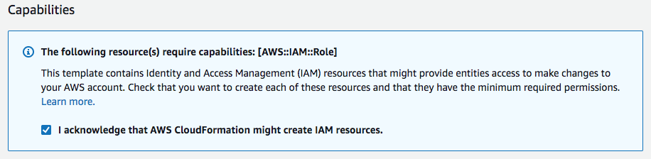
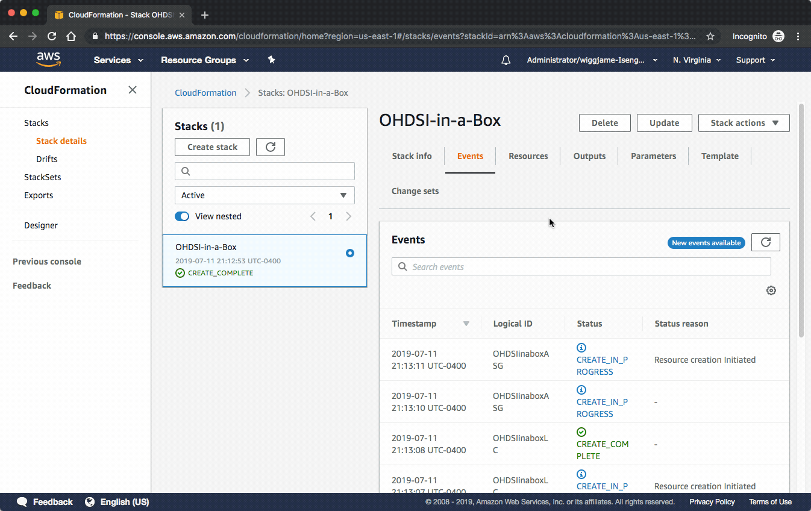
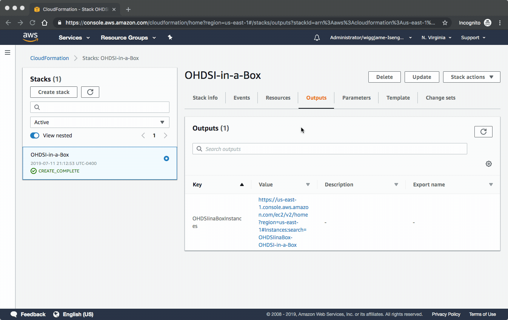

## OHDSI-Install-Server

OHDSI-Install-Server is specifically created as a learning environment, and is used in the OHDSI Tools course in the [EHDEN academy](https://academy.ehden.eu). This course provides training on how to install all the OHDSI tools. The server only includes Postgres and Notepad++ and the goal for the student is to install all the OHDSI tools.

Note that if you are looking to deploy the environment with all tools installed check out the [OHDSI-In-Box project](https://github.com/OHDSI/OHDSI-In-A-box). There is also an enterprise, scalable OHDSI architecture created in the [OHDSIonAWS project](https://github.com/OHDSI/OHDSIonAWS).  

| AWS Region Code | Name | Launch |
| --- | --- | ---
| eu-west-1 |EU (Ireland)|  |

This server has the following components installed:

| Software | Version |
| --- | ---
| Postgres | 10.9 |
| Notepad++ | 7.7.1 |

**Windows username:** ohdsi

**Windows password:** this is specified as a parameter during deployment

**Postgres username:** postgres

**Postgres password:** ohdsi

## OHDSI-Install-Server deployment instructions

0. Install an RDP client to access you OHDSI-Install-Server instance
**Windows** Windows includes an RDP client by default. To verify, type mstsc at a Command Prompt window. If your computer doesn't recognize this command, see the [Windows home page and search](https://windows.microsoft.com/) for the download for the Microsoft Remote Desktop app.
**Mac OS X** Download the Microsoft Remote Desktop app from the Mac App Store.
**Linux** Use [rdesktop](http://www.rdesktop.org/).

1. Begin the deployment process by clicking the **Launch Stack** button at the top of this page.  This will take you to the [CloudFormation Manage Console](https://console.aws.amazon.com/cloudformation/) and specify the OHDSI Cloudformation template URL (https://OHDSI-Install-Server-build.s3-eu-west-1.amazonaws.com/ohdsi-install-server.yaml).  In the top-right corner of the console, choose the EU Ireland AWS Region, and then click **Next**. Note that at the moment you can only deploy in this region.

2. The next screen will take in all of the parameters for your OHDSI environment.  A description is provided for each parameter to help explain its function, but following is also a detailed description of how to use each parameter.  At the top, provide a unique **Stack Name**.   

#### Security
|Parameter Name| Description|
|---------------|-----------|
| Instance Password | **Required** This password will be used to allow you to login to the OHDSI-Install-Server instance.  It can contain upper and lowercase letters, numbers, and/or these special characters !@# |
| Limit access to IP address range? | **Required** This parameter allows you to limit the IP address range that can access your Atlas and RStudio servers. It uses CIDR notation. The default of 0.0.0.0/0 will allow access from any address.|

#### Scaling
|Parameter Name| Description|
|---------------|-----------|
| Number of OHDSI-Install-Servers instances to deploy | This determines the number of OHDSI-Install-Server instances that will be deployed.  This allows you to easily deploy more than 1 instance if you are using it for a virtual training environment. |
| Instance type to use for each OHDSI-Install-Server instance | This determines the processing power of your OHDSI-Install-Server instance.  Typically, t3.medium offers a good balance between cost and performance  For more information, see the [list of available EC2 instance types](https://aws.amazon.com/ec2/instance-types/). |
| Instance type to use for each OHDSI-Install-Server instance | This determines the processing power of your OHDSI-Install-Server instance.  Typically, t3.medium offers a good balance between cost and performance  For more information, see the [list of available EC2 instance types](https://aws.amazon.com/ec2/instance-types/). |
| Disk space for each OHDSI-Install-Server instance | This defines the disk size of the OHDSI-Install-Server instance in GBs.  The minimum size is 100GB and the maximum size is 16,000GB (or 16TB).  You can use this parameter to deploy additional disk space in order to upload your own data into your OHDSI-Install-Server instance. |

#### Networking
|Parameter Name| Description|
|---------------|-----------|
| Subnet | This is the subnet within an AWS VPC into which all of your instances will be deployed.  If you aren't familiar with this setting, you can choose a subnet from within your Default VPC.  They typically have a name like **subnet-111111a (172.31.0.0/20)** |
| VPC | This is the AWS VPC into which all of your instances will be deployed.  It must be the VPC that contains the subnet you specified above.  If you aren't familiar with this setting, you can choose your Default VPC.  It will typically have a name like **vpc-111111a (172.31.0.0/16)** |

When you've provided appropriate values for the **Parameters**, choose **Next**.

3. On the next screen, you can provide some other optional information like tags at your discretion, or just choose **Next**.

4. On the next screen, you can review what will be deployed.  Be sure to check the box that says **I acknowledge that AWS CloudFormation might create IAM resources.** as shown in the image below.  Then choose **Create**.

5. You can watch as CloudFormation builds out your OHDSI environment. A CloudFormation deployment is called a *stack*. The parent stack creates several child stacks depending on the parameters you provided.  When all the stacks have reached the green CREATE_COMPLETE status, as shown in the screenshot following, then the OHDSI architecture has been deployed.  Select the **Outputs** tab to find a link to your OHDSI-Install-Server instances, as shown below.

6.  You will now see a list of all of your OHDSI-Install-Server instances and you can connect to them using your Remote Desktop client, the username **ohdsi** and the password you provided as a parameter.  It will take about 5 minutes after this list appears for each OHDSI-Install-Server instance to boot up and for the password to be set.  If you connect to your instance and it says the password is incorrect, just wait a few more minutes for the password automation to complete.

7.  Once you are finished with your OHDSI-Install-Server instances, just return to the AWS CloudFormation console and **Delete** the stack, as shown below.  This will terminate all of the instances you launched.

## License

This library is licensed under the Apache 2.0 License.
